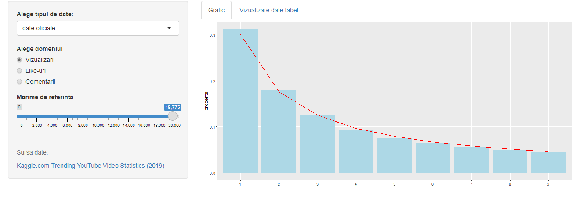
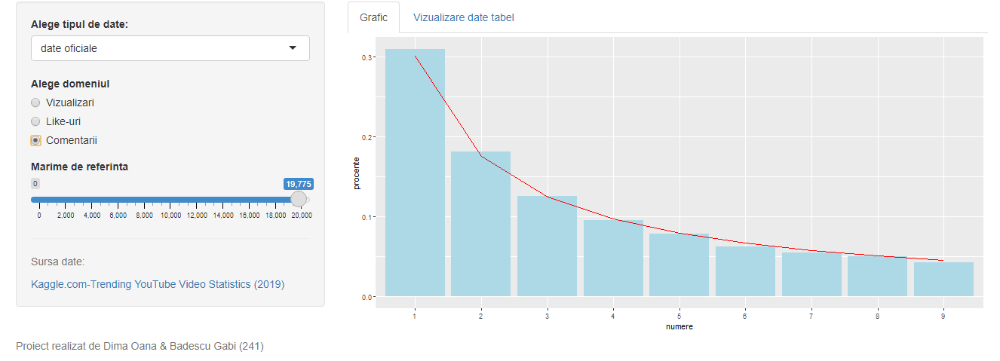
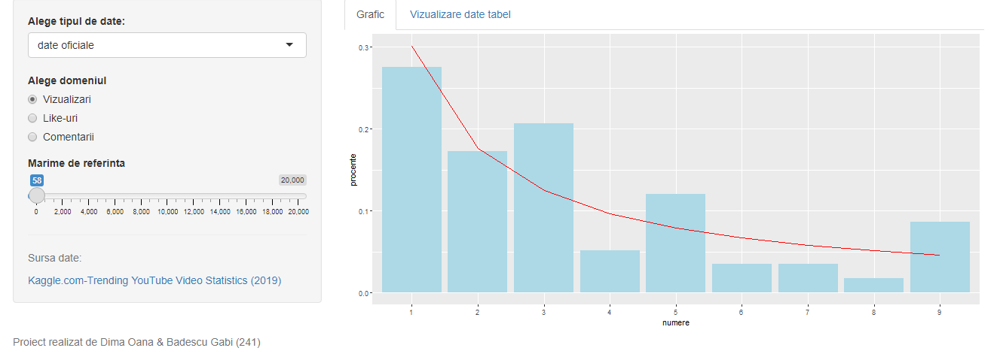
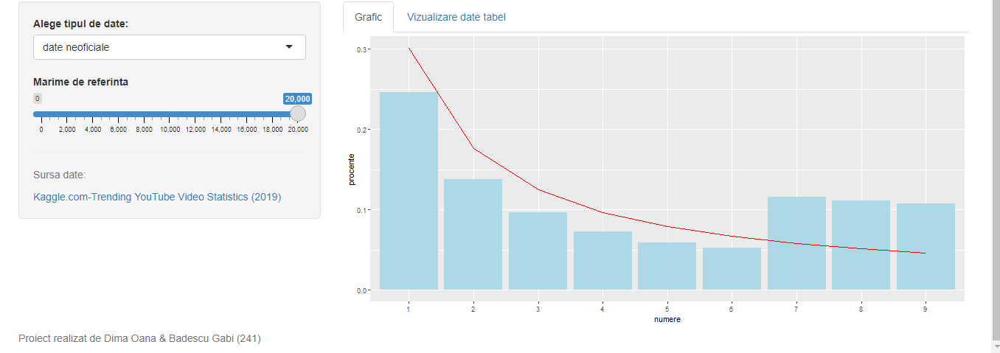
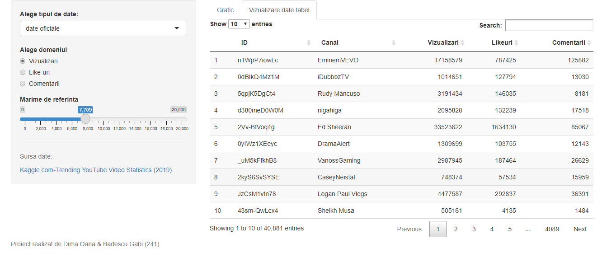

```{r setup, include=FALSE}

knitr::opts_chunk$set(echo = TRUE)
```

```{css, echo = FALSE}
@import url('https://fonts.googleapis.com/css2?family=Comfortaa:wght@600&family=Poppins&family=Josefin+Sans:wght@500&family=Ubuntu&display=swap');

body {font-family: 'Monsterrat Regular', sans-serif;}

title {font-family: 'Josefin Sans', sans-serif;}

p{
  font-size: 17px;
}

```
# Raport {.tabset }


## Despre legea lui Benford {#foo}


   **Legea lui Benford** numită și legea primei cifre reprezintă analiza primei cifre dintr-un set de date numerice din viața reală. Legea spune că într-un set de date numerice, prima cifră din fiecare înregistrare din tabel urmează o anumită distribuție. În seturile care respectă legea, cifra 1 apare în procent de 30% în timp ce cifra 9 apare cel mai puțin, în procent de 4,5%. În mod normal, dacă cifrele ar fi fost distribuite în mod egal, fiecare ar fi trebuit să apară  în procent de 11,1%. Legea lui Benford este folosită pentru a detecta fraude bancare, electorale, de cărți de credit sau de taxe. Ea nu se aplică în cazul datelor care au limitare de interval (ex:numărul de pasageri dintr-un avion), au sub 500 de înregistrări sau au date generate în format fix (ex:numere de telefon,CNP). \
   
 Formula legii:
   
   $P(d)=lg (d+1) -lg(d)=lg(\frac{d+1}{d})=lg(1+\frac{1}{d})\ , unde \ d\in\{1..9\}$\
   Procentajul apariției fiecărei cifre este proporțional cu spațiul dintre d și d+1 pe o scară logaritmică. Astfel, distribuția lui Benford este așteptată, dacă logaritmii numerelor sunt distribuiți aleator și uniform. De exemplu dacă avem x un număr,  1$\leqslant$ x $\leqslant$ 9, atunci pentru un x $\in$ [1,2] după logaritmare vom avea x $\in$ [lg 1,lg 2], interval care este mult mai larg decât  [lg 9, lg 10] (primul are 0,3 iar al doilea 0,05) de aceea, dacă *lg x* este distribuit uniform și aleator, este mult mai probabil să cadă în intervalul mai larg, adică să înceapă cu cifra 1 decât cu cifra 9. 

## Prezentare aplicație
Pentru a ilustra aplicabilitatea Legii lui Benford, aplicația noastră și-a propus să analizeze două seturi de date, unul pe care se aplică legea și unul pe care nu.\
**Primul** set reprezintă [analiza datelor aplicației Youtube pentru Canada în anul 2019][2]. Am ales acest set de date, deoarece atât numărul de vizualizări cât și numărul de aprecieri sau comentarii respectă condițiile Legii lui Benford: să fie numere generate aleator, predispuse creșterii exponențiale, nerestricționate de maxime sau minime, iar calculele să aibă loc pe eșantioane mari de date. Astfel, prin intermediul interfeței, utilizatorul poate să aleagă pentru ce categorie de date dorește să vadă aplicabilitatea legii (aprecieri , vizualizări sau comentarii). Din imaginile de mai jos se poate observa că legea se aplică în cazul acestor date:
  
\
Însă pentru un set de date mai mic, legea nu este aplicabilă :

Pe lângă datele oficiale, utilizatorul poate opta să vadă și niște date care au fost modificate de noi, pentru a arăta faptul că Legea lui Benford semnalează o eventuală fraudă.

De asemenea, aplicația permite utiizatorului să vadă și tabelele cu date pentru a vedea mărimile de referință.

**Al doilea** set de informații reprezintă [analiza vânzărilor unei companii de supermarketuri din Myanmar][3] care a înregistrat timp de 3 luni, date din fiecare oraș din țară. Astfel, am observat conform graficelor din poza de mai jos, faptul că Legea lui Benford nu este aplicabilă pentru numere care sunt limitate de un interval (rating-ul ia valori de la 1 la 9, iar oamenii tind să acorde note mai bune, astfel cifrele mai mari vor fi cele predominante), cantitatea care nu crește exponențial (scară de referință mică) și ID-urile care sunt unice (automat distribuția primei cifre tinde să fie egală).


## Detalii implementare {#fo}


\
  Am creat această aplicație folosind limbajul R împreună cu pachetele: [shiny][1] și [ggplot2][4]. Aplicația respectă arhitectura pachetului Shiny fiind împărțită în 3 părți:\
      1. [UI](#ui)  \
      2. [Partea de server](#server)\
      3. [shinnyApp](#shiny)\

### UI: {#ui}
La partea de UI am folosit **navbarPage()**, deoarece avem 2 experimente, iar fiecare va fi afișat pe câte o pagină. Am folosit tabPanel pentru a crea tabul primulului experiment : 
``` {}
   navbarPage("Benford App",
             #experiment 1
             tabPanel("Experimentul YoutTube",
                      h3("Legea lui Benford"),
                      uiOutput('formula'),
                      h4("Experimentul YouTube (Date de referință Canada 2019)"),
                      textOutput("text1"),
                      textOutput("text2"),

``` 
Datorită valorilor argumentelor se pot afișa: numele tabului curent, titlul, formula lui Benford și câteva informații (în cadrul UI le-am dat niște id-uri, iar asignarea valorilor pentru obiecte va avea loc pe partea de server). 
Am folosit **sidebarLayout()** pentru a crea o zonă specială pentru inputuri. Aplicația are inputuri de tipul *dropdown list* , unde utilizatorul alege ce tip de date să citească (oficiale/neoficiale), *radioButon* unde utilizatorul poate vedea legea aplicată pe mai multe tipuri de date (numărul like-urilor, vizualizărilor,comentariilor), cât și *sliderInput* unde utilizatorul alege pentru ce număr de observații să fie aplicată Legea lui Benford.
```
      
      selectInput("tip", "Alege tipul de date:", 
                  choices=c('date oficiale', 'date neoficiale')),
      #input conditional pentru datele oficiale
      conditionalPanel(condition = "input.tip == 'date oficiale' ",
                       
      #sunt mai multe coloane care respecta legea   choices=c('views', 'likes', 'comment_count')              
      radioButtons("coloana", "Alege domeniul", 
                   choiceNames = c('Vizualizari','Like-uri','Comentarii'),
                   choiceValues = c('views', 'likes', 'comment_count') 
                   )
      #sfarsit condiție
      ),
      sliderInput("n", "Mărime de referință", min = 0, max =20000, value = 100),
   
```
Partea de output se face prin intermediul **mainPanel()**. Se afișează atât graficele pe care este aplicată legea cât și tabelele asociate, ele fiind împărțite în tab-uri separate:
```   mainPanel(
      #creare tab-uri
      tabsetPanel(
      tabPanel("Grafic", plotOutput("date")), 
      tabPanel("Vizualizare date tabel", DT::dataTableOutput("mytable") )
      )
    )
```
Pentru al doliea experiment am folosit un **tabPanel()** unde am afișat textele din server prin intermediul **textOutput())**, iar pentru împărțirea sa în 3 părți egale am folosit **flouidRow()**, care are atributul **column** ce ia valoarea 4, semnificând lățimea fiecărei coloane. În cadrul fiecărei coloane afișăm tipul de date pe care am făcut analiza pus în evidență de **h4()**, apoi folosindu-ne de funcția **helpText()** am precizat cauza acestor rezultate eronate pentru lege, iar graficele le-am afișat cu funcția **plotOutput()**:

```
tabPanel("Unde nu funcționează?",
           h3("Analiza vânzărilor din supermarket (2019)"),
           textOutput("text3"),
           textOutput("text4"),
           fluidRow(
             column(4,
                    h4("Rating"),
                    helpText("Cauza: limitare interval"),
                    plotOutput("grafic1")
                    ),
             column(4, 
                    h4("Cantitate"),
                    helpText("Cauza: nu creste exponențial"),
                    plotOutput("grafic2")
             ),
             column(4,
                    h4("ID Factura"),
                    helpText("Cauza: numere unice"),
                    plotOutput("grafic3")
             )
           )
           )
 ```
           
### Server: {#server}   
Am folosit **renderText({})** pentru atribuirea textelor către argumentele din UI. Exemplu :
```
  output$text4<-renderText({
    "Se poate observa că Legea lui Benford nu este aplicabila pe anumite tipuri de date.
    "
  })
```
Pentru afișarea formulei lui Benford am folosit **withMathJax()**, care ne permite să afișăm ecuații matematice complexe:

``` withMathJax(
      #afișare formula legea lui Benford
      helpText('$$P(d)=lg (d+1) -lg(d)=lg(\\frac{d+1}{d})=lg(1+\\frac {1}{d}), d\\în\\{1..9\\}$$'))
```
Am creat obiectul Benford:
```
 Benford<- function(rate, linii_coloana)
``` 
care primește o funcție cu 2 argumente: coloana din care s-au citit datele și lungimea acesteia. Extragem prima cifră cu ajutorul funcției: 
```
 primaCifra<-function(x) as.numeric(substr(gsub('[0.]', '', x), 1, 1))
``` 
Reținem frecvența fiecărei cifre prin intermediul unui vector de frecvență pentru cifrele din intervalul [1,9] și reținem în obiectul *total* numărul total de observații cu scopul de a calcula procentul fiecărei cifre reținut în vectorul de procente:
```
frecv<-c(0,0,0,0,0,0,0,0,0)
    for (i in 1:linii_coloana)
    {
      cifra<-primaCifra(rate[i])
      frecv[cifra]<-frecv[cifra]+1
    }
    total<-sum(frecv)
    procent<-c(0,0,0,0,0,0,0,0,0)
    for (i in 1:9)
    {
      procent[i]<-frecv[i]/total #calculez procentul 
      #de cate ori apare cifra i/ nr total de apariție al cifrelor
    }
```
Am calculat valorile standard ale lui Benford și le reținem într-un *data frame*:
```
benford<-c(0,0,0,0,0,0,0,0,0)
    for (i în 1:9)
    {
      benford[i]<-log10(1+ 1/i)
    }

    frame3<-data.frame(
      numere=c("1","2", "3", "4", "5", "6", "7", "8", "9"),
      ben=benford,
      procente=procent
    )
```
Generarea graficului se va face prin funcția **ggplot()** din librăria **ggplot2** care va primi ca argument data frame-ul de mai sus, iar procentelul apariției fiecărei cifre va fi afișat sub formă de bar-uri(dreptunghiuri) prin intermediul **geom_bar(aes(y=procente))** unde argumentul **aes()** arată axa pe care se face afișarea, iar curba lui Benford va fi creată cu **geom_line(aes(y=ben))** :
```
  ggplot(data = frame3, aes(x = numere, group=1))+ geom_bar(aes(y = procente), stat = "identity", color=NA, fill="lightblue") + geom_line(aes(y = ben), stat = "identity", color="red") 
```
Citirea din fișierului de tip CSV, se va face cu ajutorul funcției **read.csv()**. În obiectul *nume_csv*, se va reține alegerea utilizatorului din primul dropdown, iar prin intermediul funcției **paste()** se va lipi extensia *.csv* la acesta. Datele din tabel se vor afla în obiectul *data1*:
```
nume_csv<-paste(input$tip, ".csv", sep="")
    data1<-(read.csv(nume_csv, header=TRUE))
    
```
Vom reține numele coloanei în obiectul *nume_coloana* și în funcție de aceasta, îi vom atribui obiectului *rate* coloana aleasă de utilizator din al doilea dropdown (și cea pe care vom aplica legea lui Benford):
```
 nume_coloana<-input$coloana
    if (nume_coloana == 'likes')
      rate<-data1$likes
    else if (nume_coloana == 'comment_count')
      rate<-data1$comment_count
    else 
      rate<-data1$views
```
Pentru crearea tabelului vom folosi data frame-ul *tabel*, în care vom reține coloanele pe care dorim să le afișăm și vom trimite tabelul către UI cu obiectul *mytable* care primește informațiile din tabel cu funcția **DT::renderDataTable({tabel})** 
```
 tabel<- data.frame(
      ID=data1$video_id,
      Canal=data1$channel_title,
      Vizualizari=data1$views,
      Likeuri=data1$likes,
      Comentarii=data1$comment_count
      
    )
    output$mytable = DT::renderDataTable({tabel})
```
Pentru al doilea experiment aplicăm același algoritm de extragere al datelor pe care îl utilizăm și pentru primul experiment. Vor fi create 3 obiecte *output&grafic1*, *output&grafic2*, *output&grafic3*, care se vor afișa fiecare pe câte o coloană.
```
 data2<-(read.csv('Sales.csv', header=TRUE))
  output$grafic1 <- renderPlot({ 
    rate<-data1$Rating
    Benford(rate, length(rate))
    
    })
  output$grafic2 <- renderPlot({
    rate<-data1$Quantity
    Benford(rate, length(rate))
  })
  output$grafic3 <- renderPlot({
    rate<-data1$Invoice.ID
    Benford(rate, length(rate))
  })
```

### ShinyAPP {#shiny}
Crearea aplicației și rularea acesteia:
```
shinyApp(ui = ui, server = server)
```

\
\
\
\
\

## Cod aplicație

```
#####################################
  #Dima Oana & Badescu George Gr. 241
  #Proiect Probabilitati si statistica 
  #Februarie 2021
  #Legea lui Benford 
#######################################

library(shiny)
library(ggplot2)
library(datasets)
library(shinyWidgets)

ui <- fluidPage(

  navbarPage("Benford App",
             #experiment 1
             tabPanel("Experimentul YoutTube",
                      h3("Legea lui Benford"),
                      uiOutput('formula'),
                      h4("Experimentul YouTube (Date de referinta Canada 2019)"),
                      textOutput("text1"),
                      textOutput("text2"),
                      
  sidebarLayout(      
    sidebarPanel(
      
      selectInput("tip", "Alege tipul de date:", 
                  choices=c('date oficiale', 'date neoficiale')),
      #input conditional pentru datele oficiale
      conditionalPanel(condition = "input.tip == 'date oficiale' ",
                       
      #sunt mai multe coloane care respecta legea   choices=c('views', 'likes', 'comment_count')              
      radioButtons("coloana", "Alege domeniul", 
                   choiceNames = c('Vizualizari','Like-uri','Comentarii'),
                   choiceValues = c('views', 'likes', 'comment_count') 
                   )
      #sfarsit conditie
      ),
      sliderInput("n", "Marime de referinta", min = 0, max =20000, value = 100),
      
      hr(),
      helpText("Sursa date:"),
      tags$a(href="https://www.kaggle.com/datasnaek/youtube-new?select=CAvideos.csv", "Kaggle.com-Trending YouTube Video Statistics (2019)")
    ),
    
    #afisare grafic / tabel cu date
    mainPanel(
      #creare tab-uri
      tabsetPanel(
      tabPanel("Grafic", plotOutput("date")), 
      tabPanel("Vizualizare date tabel", DT::dataTableOutput("mytable") )
      )
    )
    
  )
             ),
  tabPanel("Unde nu functioneaza?",
           h3("Analiza vanzarilor din supermarket (2019)"),
           textOutput("text3"),
           textOutput("text4"),
           
           
           fluidRow(
             column(4,
                    h4("Rating"),
                    helpText("Cauza: limitare interval"),
                    plotOutput("grafic1")
                    
             ),
             column(4, 
                    h4("Cantitate"),
                    helpText("Cauza: nu creste exponential"),
                    plotOutput("grafic2")
                  
             ),
             column(4,
                    h4("ID Factura"),
                    helpText("Cauza: numere unice"),
                    plotOutput("grafic3")
                    
             )
           )
           ),
  helpText("Proiect realizat de Dima Oana & Badescu Gabi (241)")
  )
  
)

#################################################################################
#
# Server function
#
server <- function(session,input,output) {
  #zona de text
  output$text1<-renderText({
    "Este cunoscut faptul ca numarul vizualizarilor
    video-urilor de pe YouTube respecta ipotezele de examinare a datelor de catre lege:
    sa fie numere generate aleator, predispuse cresterii exponentiale, nerestrictionate de maxime sau minime, iar 
    calculele sa aiba loc pe esantioane mari de date.
    "
  })
  output$text2<-renderText({
    "
    Se poate observa cum de la primele 1500 de vizualizari procentele se aproprie
    de respectarea legii. Tabelul cu date neoficiale contine date modificate manual, neconforme cu 
    realitatea care demonstreaza faptul ca Legea lui Benford poate sa semnaleze in anumite cazuri frauda.
    
    "
  })
  output$text3<-renderText({
    "
    Setul de date reprezinta vanzarile unei companii de 
    supermarketuri din Myanmar care a inregistrat timp de 3 luni,
    date din fiecare oras din tara. 
    "
  })
  output$text4<-renderText({
    "
    Se poate observa ca Legea lui Benford nu este aplicabila pe anumite tipuri de date.
    "
  })
  output$formula <- renderUI({
    withMathJax(
      #afisare formula legea lui Benford
      helpText('$$P(d)=lg (d+1) -lg(d)=lg(\\frac{d+1}{d})=lg(1+\\frac {1}{d}), d\\in\\{1..9\\}$$')
    )
  })
  #functie care genereaza graficul legii lui Benford pentru un set de date
  Benford<- function(rate, linii_coloana)
  {
    #extrag prima cifra
    primaCifra<-function(x) as.numeric(substr(gsub('[0.]', '', x), 1, 1))
    #vector de frecventa pt cifrele de la 1 la 9
    frecv<-c(0,0,0,0,0,0,0,0,0)
    for (i in 1:linii_coloana)
    {
      cifra<-primaCifra(rate[i])
      frecv[cifra]<-frecv[cifra]+1#calculez frecventa
    }
    total<-sum(frecv)#o sa ma folosesc de nr total de aparitii in calc procentului
    #vector care retine procentul pentru fiecare cifra
    procent<-c(0,0,0,0,0,0,0,0,0)
    for (i in 1:9)
    {
      procent[i]<-frecv[i]/total #calculez procentul 
      #de cate ori apare cifra i/ nr total de aparitie al cifrelor
    }
    benford<-c(0,0,0,0,0,0,0,0,0)
    for (i in 1:9)
    {
      benford[i]<-log10(1+ 1/i)#calculez valorile standard ale lui Benford 
    }
    #formez un data frame din care o sa generez graficul
    frame3<-data.frame(
      numere=c("1","2", "3", "4", "5", "6", "7", "8", "9"),
      ben=benford,
      procente=procent
    )
    #generare grafic
    ggplot(data = frame3, aes(x = numere, group=1))+ geom_bar(aes(y = procente), stat = "identity", color=NA, fill="lightblue") + geom_line(aes(y = ben), stat = "identity", color="red") 
    
  }

  #grafice
  output$date <- renderPlot({
    
    #citire din fisierul dat ca input din dropdown
    nume_csv<-paste(input$tip, ".csv", sep="")
    data1<-(read.csv(nume_csv, header=TRUE))
    
    #afisare tabel cu date
    tabel<- data.frame(
      ID=data1$video_id,
      Canal=data1$channel_title,
      Vizualizari=data1$views,
      Likeuri=data1$likes,
      Comentarii=data1$comment_count
      
    )
    output$mytable = DT::renderDataTable({tabel})
    #incheiere afisare tabel cu date
    
    #extrag numele coloanei acolo unde al doilea dropdown a fost activ
    nume_coloana<-input$coloana
    if (nume_coloana == 'likes')
      rate<-data1$likes
    else if (nume_coloana == 'comment_count')
      rate<-data1$comment_count
    else 
      rate<-data1$views
    
    #aplic legea lui Benford pt n date de Slidebar
    
    #lucrez doar pe coloana Views
    linii_coloana<-input$n
    
    Benford(rate, linii_coloana)

   
  })
  data2<-(read.csv('Sales.csv', header=TRUE))
  output$grafic1 <- renderPlot({ 
    rate<-data1$Rating
    Benford(rate, length(rate))
    
    })
  output$grafic2 <- renderPlot({
    rate<-data1$Quantity
    Benford(rate, length(rate))
  })
  output$grafic3 <- renderPlot({
    rate<-data1$Invoice.ID
    Benford(rate, length(rate))
  })
  
}
shinyApp(ui = ui, server = server)
```

## Surse
 https://shiny.rstudio.com/  \
 https://www.kaggle.com/datasnaek/youtube-new?select=CAvideos.csv \
 https://www.kaggle.com/aungpyaeap/supermarket-sales \
 https://ggplot2.tidyverse.org/ \
 https://en.wikipedia.org/wiki/Benford%27s_law \
 https://www.youtube.com/watch?v=BO3WFTw6eqE \
 https://www.isaca.org/resources/isaca-journal/past-issues/2011/understanding-and-applying-benfords-law \

[1]: https://shiny.rstudio.com/
[2]: https://www.kaggle.com/datasnaek/youtube-new?select=CAvideos.csv
[3]: https://www.kaggle.com/aungpyaeap/supermarket-sales
[4]: https://ggplot2.tidyverse.org/
[5]: https://en.wikipedia.org/wiki/Benford%27s_law
[6]: https://www.youtube.com/watch?v=BO3WFTw6eqE
[7]: https://www.isaca.org/resources/isaca-journal/past-issues/2011/understanding-and-applying-benfords-law